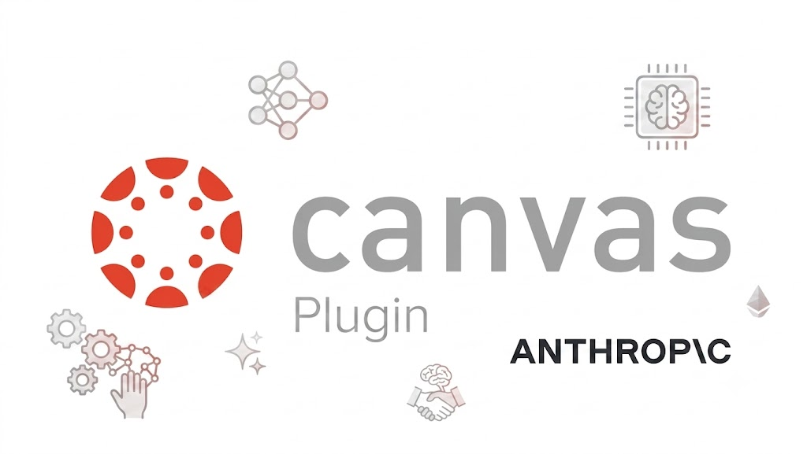

<p align="center">
  
</p>

<h1 align="center">Canvas Course Builder</h1>

<p align="center">
  <em>Drop your syllabus. Get quizzes and rubrics that import clean and add up.</em>
</p>

<p align="center">
  
  
  
  
</p>

---

Building a course in Canvas is mostly assembly work: turning a syllabus, a workbook, and a pile of slides into quizzes and rubrics that import cleanly and grade correctly. This tool does that assembly for you.

Point your AI coding agent at this repository, drop in your course files, answer a few questions, and it produces Canvas-ready quizzes and rubrics — each one checked so the points add up and every question traces back to something in your materials.

## Who it's for

Instructors who build and maintain courses in Canvas and would rather not hand-format QTI XML or chase a points total that's off by two. You don't need to know what QTI is. The agent handles the format; you check the questions.

## Install it in Claude Code

This repo is a Claude Code plugin. Add it as a marketplace, then install it:

```
/plugin marketplace add emaduneme/canvas-course-builder
/plugin install canvas-course-builder@canvas-course-builder
```

That's it — the `/course-build` command and the builder are now available in your session.

If you'd rather not install anything, you can also just hand the repo link to any AI coding agent:

```
https://github.com/emaduneme/canvas-course-builder
```

Tell it what you want — "build me a 10-question quiz on this week's reading" — and point it at your files. It reads the instructions here and takes it from there.

## How to use it

Once it's installed, run:

```
/course-build
```

The flow is the same whether you run the command or work through an agent:

1. Put your course files (syllabus, workbook, slides, readings) in a folder.
2. Ask for a quiz or a rubric.
3. Review the `course-profile.yml` it writes — that's the plan for your course, in plain text. Fix anything it got wrong.
4. It builds the artifacts and checks them before handing them back.
5. Zip a quiz and import it in Canvas: **Course → Settings → Import Course Content → Common Cartridge 1.x Package**.

## What you get

| Artifact | Format | What you do with it |
|---|---|---|
| Quiz | Common Cartridge + QTI package (a zip) | Import straight into Canvas |
| Rubric | Canvas rubric XML, or a CSV you can paste | Attach to an assignment |
| Receipt | `trace.json` next to each file | See which source each question came from and that the checks passed |

## How it works

The build runs in stages, and nothing reaches you until the last one signs off:

```
You ask for a quiz
   │
   ▼
Intake    interviews you, looks at your files, and writes course-profile.yml
   │
   ▼
Builders  one drafts the quiz questions, another drafts the rubric —
   │       each working only from the part of the profile it needs
   ▼
Verifier  checks that every question is tagged to a real source and the
   │       points add up; writes the trace.json receipt
   ▼
Verified files land in your output folder
```

The verifier is the point of the whole thing. A quiz that imports but silently totals 18 points instead of 20, or includes a question you can't tie to any reading, is worse than no quiz. So the builder never gets the last word — the checker does.

## Why questions trace to sources

Every question carries a tag back to where it came from:

```
### Q3 (Multiple Choice) [src: workbook-ch3 §p.42] [points: 2]
```

This keeps the quiz honest. If `source_tagging` is set to `required`, the verifier rejects the build unless every question is tagged, every tag points to a real source you listed, and the question points sum to the quiz total. Rubrics get the same treatment: the criteria have to add up to the total you set.

You end up able to answer "where did this question come from?" for all of them, which matters when a student asks.

## Pulling in outside research (optional)

If a topic isn't covered in the files you dropped, list it as a research source and the tool gathers material before any question is written, so the traceability still holds. It uses whatever search is available to you — Perplexity if you've set up a key, then Apify, and plain web search otherwise. With no keys at all it still works. See [`references/research-integration.md`](references/research-integration.md) for the details.

## What's in the repo

For agents and anyone reading the code, here's the layout:

```
.claude-plugin/plugin.json     plugin manifest
commands/course-build.md       the /course-build entry point
agents/                        intake · question-worker · rubric-worker · verifier · module-worker (stub)
skills/
  course-builder/SKILL.md      the orchestrator that runs the pipeline
  course-builder/scripts/      verify.py (the checks + trace.json) · research_provider.py
  canvas-export/               builds the Canvas quiz package
templates/course-profile.template.yml
references/                    profile-schema.md · research-integration.md
evals/                         run_evals.py · fixtures/
```

## Commands and agents

You only ever type one command. The agents are dispatched for you, in order, by the orchestrator — they're listed here so you (or your AI agent) can see exactly what runs and when.

**Commands**

| Command | What it does |
|---|---|
| `/course-build` | Build verified, Canvas-importable artifacts (quizzes + rubrics) from a course profile. The single entry point. |

**Agents** (run automatically by the pipeline, in this order)

| Agent | Role | When it runs |
|---|---|---|
| `intake` | Interviews you, catalogs your dropped files, runs optional research for `type: research` sources, and writes `course-profile.yml` — the single source of truth. | First |
| `question-worker` | Drafts a tagged `source.md` quiz honoring `quiz_defaults`, then builds the Canvas QTI/Common-Cartridge package. Sees only `quiz_defaults` + `course` + `sources`. | Build |
| `rubric-worker` | Drafts a grading rubric whose criteria sum exactly to `total_points`, exported in your chosen format. Sees only `rubric_defaults` + `course` + `sources`. | Build |
| `verifier` | Checks source traceability and points integrity, runs the QTI structural checks, and writes the `trace.json` receipt. Honors `output.on_verify_fail` (`halt` or `flag_and_continue`). | Last |
| `module-worker` | Deferred stub for v1 — documents intended Canvas module-building so v2 can fill it in. The orchestrator never dispatches it yet. | Not wired up |

Each worker is handed only its own slice of the profile (plus `course` and `sources`), so one agent can't quietly depend on another's state.

## Checking that it works

```bash
python3 evals/run_evals.py        # exit 0 means every check passed
```

The verifier (`skills/course-builder/scripts/verify.py`) is plain Python with no install step. It carries its own small YAML reader so it runs anywhere `python3` does — no `pip install`, nothing to set up.

## What this version does and doesn't do

- **Does:** intake, quiz building, rubric building, and verification; quiz export to Canvas; rubric export as Canvas XML or CSV.
- **Doesn't yet:** build full course modules (`module-worker` is a documented placeholder) or export to the newer Canvas "New Quizzes" format (the slot is reserved).

## License

MIT.
